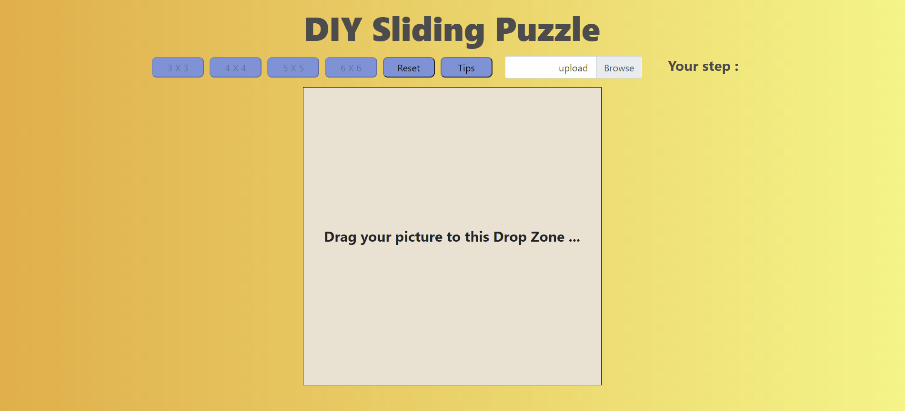

# **前端作品 - 自製拼圖**

>##  **作品特點**
>
>
>1. 透過 **FileReader** 以及 **Image** 讀取圖片並轉換成 Base64 格式以進行圖片切割
>
>2. 利用 **background-position** 控制百分比讓拼圖呈現切分狀態後，再將其打散

想看整理好的更多作品可以點擊以下連結: [Howard個人作品集](https://bs-howard.github.io/All-Portfolio/index.html)