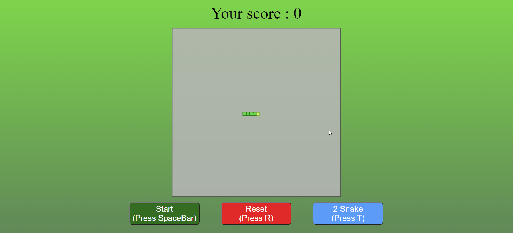

# **前端作品 - 貪吃蛇遊戲**

>##  **作品特點**
>
>
>1. 透過 **Canvas** 進行畫布渲染
>
>2. 利用 **SetTimeOut** 當吃到食物時，蛇的移動速度變快
>
>3. 可選擇兩種模式，當兩條蛇模式時碰到另一條蛇身體即失敗

想看整理好的更多作品可以點擊以下連結: [Howard個人作品集](https://bs-howard.github.io/All-Portfolio/index.html)